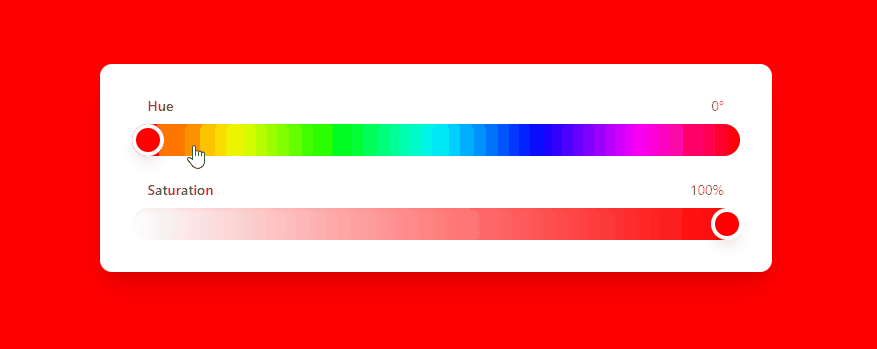

# React Color Picker

A modern, accessible color picker component built with React, TypeScript, and Tailwind CSS. Features a dual-slider interface for hue and saturation control with real-time color preview.



## Features

- Hue and Saturation controls
- Real-time color preview
- Smooth transitions
- Responsive design
- Accessible inputs
- TypeScript support
- Tailwind CSS styling

## Installation

1. Clone the repository:
```bash
git clone https://github.com/yourusername/react-color-picker.git
cd react-color-picker
```

2. Install dependencies:
```bash
npm install
```

## Dependencies

```json
{
  "dependencies": {
    "react": "^18.2.0",
    "react-dom": "^18.2.0"
  },
  "devDependencies": {
    "@types/react": "^18.2.0",
    "@types/react-dom": "^18.2.0",
    "@vitejs/plugin-react": "^4.0.0",
    "autoprefixer": "^10.4.16",
    "postcss": "^8.4.31",
    "tailwindcss": "^3.3.5",
    "typescript": "^5.0.0",
    "vite": "^4.5.0"
  }
}
```

## Usage

```tsx
import ColorPicker from './components/ColorPicker';

function App() {
  const handleColorChange = (color: string) => {
    console.log('Selected color:', color);
    // Do something with the color
  };

  return (
    <div className="min-h-screen flex items-center justify-center">
      <ColorPicker onColorChange={handleColorChange} />
    </div>
  );
}
```

## Component Props

| Prop | Type | Description |
|------|------|-------------|
| onColorChange | `(color: string) => void` | Callback function that receives the selected color in HSL format |

## Development

1. Start the development server:
```bash
npm run dev
```

2. Build for production:
```bash
npm run build
```

## Project Configuration

### Tailwind Configuration (tailwind.config.ts)
```typescript
import type { Config } from 'tailwindcss'

export default {
  content: [
    "./index.html",
    "./src/**/*.{js,ts,jsx,tsx}",
  ],
  theme: {
    extend: {
      backgroundImage: {
        'full-gradient': 'linear-gradient(to right, #ff0000, #ffff00, #00ff00, #00ffff, #0000ff, #ff00ff, #ff0000)',
      },
    },
  },
  plugins: [],
} satisfies Config
```

### TypeScript Configuration (tsconfig.json)
```json
{
  "compilerOptions": {
    "target": "ES2020",
    "useDefineForClassFields": true,
    "lib": ["ES2020", "DOM", "DOM.Iterable"],
    "module": "ESNext",
    "skipLibCheck": true,
    "moduleResolution": "bundler",
    "allowImportingTsExtensions": true,
    "resolveJsonModule": true,
    "isolatedModules": true,
    "noEmit": true,
    "jsx": "react-jsx",
    "strict": true,
    "noUnusedLocals": true,
    "noUnusedParameters": true,
    "noFallthroughCasesInSwitch": true
  },
  "include": ["src"],
  "references": [{ "path": "./tsconfig.node.json" }]
}
```

### PostCSS Configuration (postcss.config.js)
```javascript
export default {
  plugins: {
    tailwindcss: {},
    autoprefixer: {},
  },
}
```

## Browser Support

The color picker is compatible with all modern browsers:
- Chrome (latest)
- Firefox (latest)
- Safari (latest)
- Edge (latest)

## License

MIT License - feel free to use this component in your projects.

## Contributing

1. Fork the repository
2. Create your feature branch (`git checkout -b feature/amazing-feature`)
3. Commit your changes (`git commit -m 'Add some amazing feature'`)
4. Push to the branch (`git push origin feature/amazing-feature`)
5. Open a Pull Request

## Acknowledgments

- Built with [Vite](https://vitejs.dev/)
- Styled with [Tailwind CSS](https://tailwindcss.com/)
- TypeScript support
